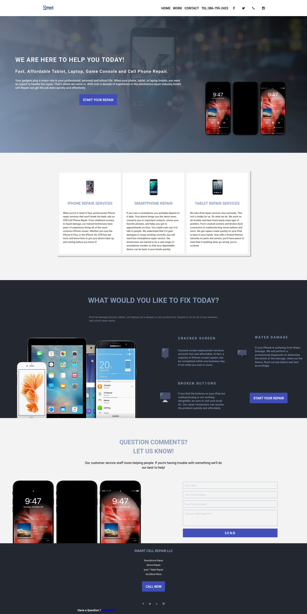
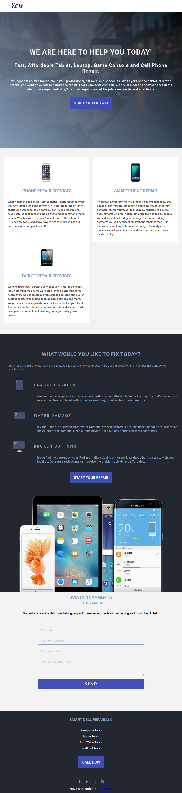
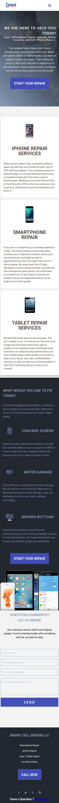

# Smart Cell Repair [Live Site](http://www.smartcell.repair/)


## My first freelance project


### The Problem :
    In early february a local business approach me with this problem they were looking for an online presence to interact with potential costumer's and a way for them to connect and offer they're service and increase potential revenue.

### The Search of the best solution:
    
* The fist step for a potential solution was to ask all the necessary questions.
* Show a couple of competitor websites and learn from them what is compelling to the costumer and to the client.
* Make a Wire-frame and explain the points and look and feel of the website.
* Ask my client if they want a custom built website or would like to purchase a prebuilt team.
* After searching what was the best solution to interact and collect information from the Front-End of the website , i choose to use Node-mail to send all the data collected to the client.

### Solution and tech use :
#### HTML5
```html5
   <!DOCTYPE html>
```
#### CSS
```css
    /*Custom properties or css variables*/
    --css-varibles:#fff;
    /*FlexBox was use to have a fallback for the grid for Browser that dont supports it */
    display:flex;
    /*The main property display - grid */
    display:grid;
    /*Media  query for  responsive , good looking and  good user experience for mobile device */
    @media (...){
        ....
    }
```
#### JAVASCRIPT 
```javascript
    /*Use the fetch api to send the data collected from the form to the back end */
    fetch();
    
```
#### JSON
#### NPM
#### NODE
#### HANDLEBARS
#### EXPRESS 
#### NODE-MAILER
#### GOOGLE RECAPCHA 

## The Result :
    Desktop:



    Medium Size Device:

    Small Device:
